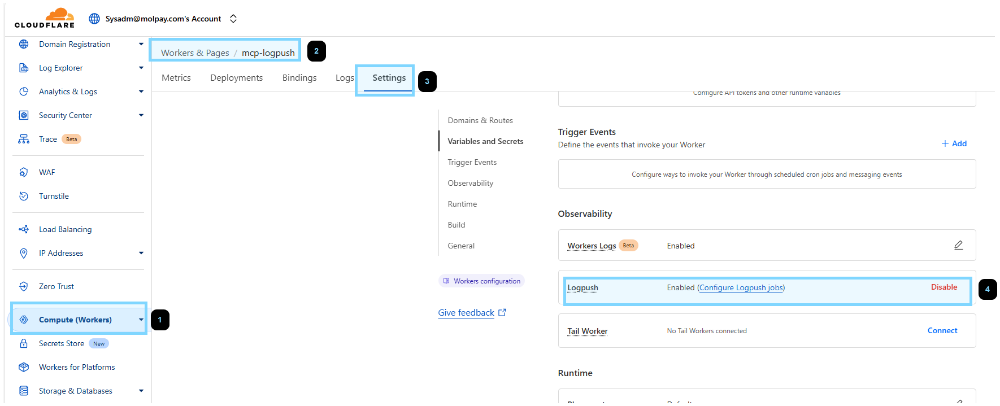
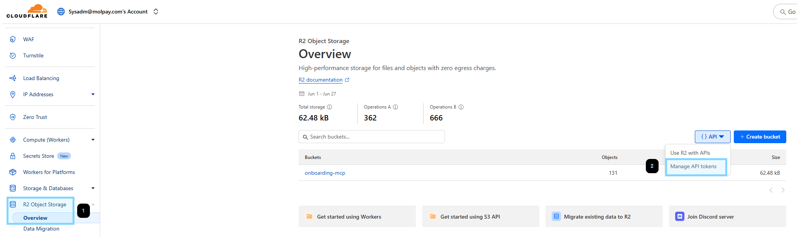
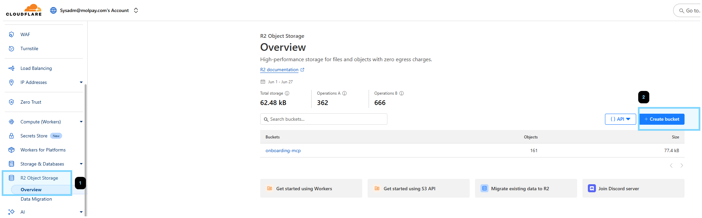
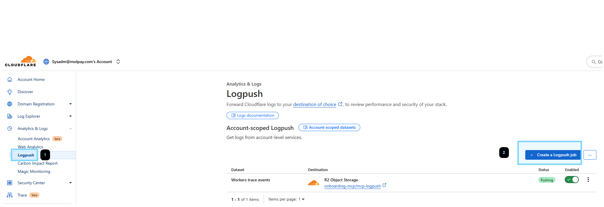
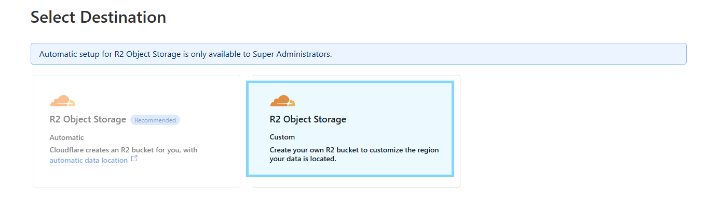
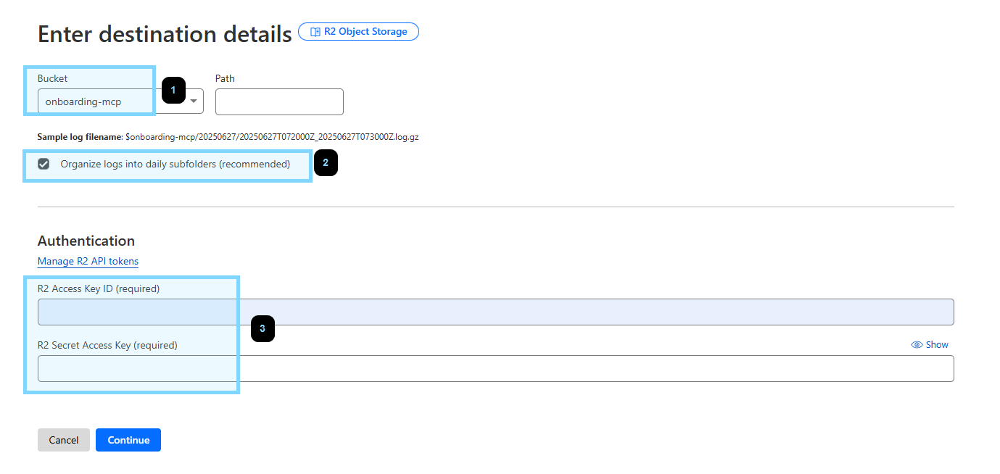
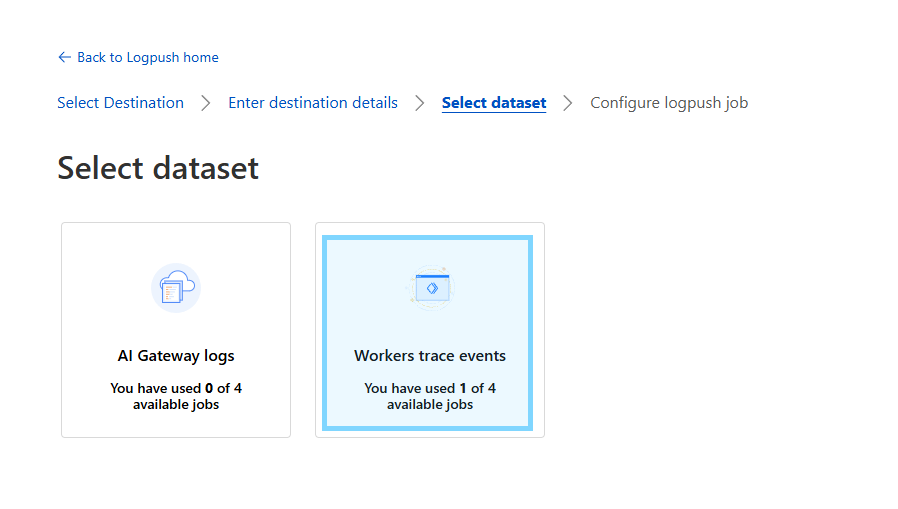
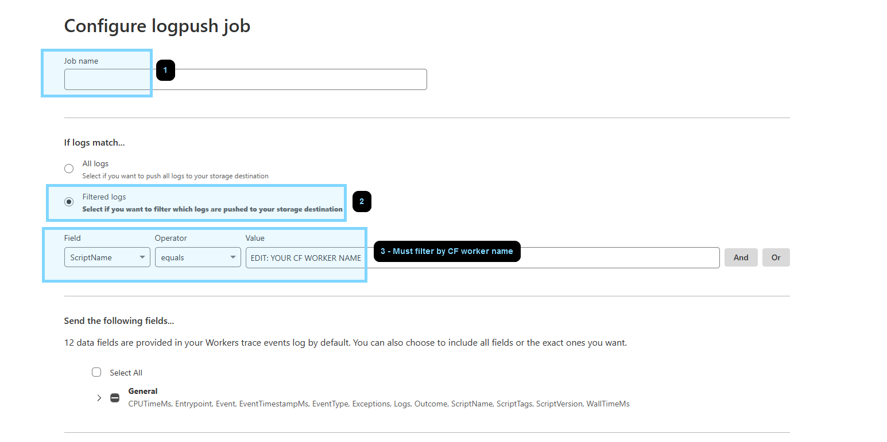

# Setup: -
- Start up container
    > `docker compose up -d`
- Initialize **package.json**
    - > `npm init -y` (First time to create package.json)
    - > `npm install`

# MCP Server Creation
- Create from CF template
    - > `npm create cloudflare@latest -- mcp-logging --template=cloudflare/ai/demos/remote-mcp-authless`
    - *If **clone template failed**, git clone cloudflare/ai repo below, then recreate*
        > `git clone https://github.com/cloudflare/ai.git`
- Start dev server
    - Update to use `wrangler dev --ip 0.0.0.0` IP in **package.json**
    - Port mapping `8787:8787` in **docker-compose.yml**
    - `npm start` OR `wrangler dev --ip 0.0.0.0`
    - Access via `localhost:8787/sse`

# Deploy CF Worker
- Set CF account ID to **wrangler.jsonc**
    > `"account_id": "<EDIT-HERE>"`
- Set CF API key in env
    - API's permission template: `Edit Cloudflare Workers`
    - ENV: `CLOUDFLARE_API_TOKEN=<EDIT-HERE>`
- Deploy worker to CF
    - `npm run deploy` OR `npx wrangler deploy`

# MCP Inspector
- Start inspector
    > `npx @modelcontextprotocol/inspector@latest`

# Connect via MCP Host/Client
- Ensure `mcp-remote` is installed
    > npm install mcp-remote
- MCP server config
    > ```json
    > {
    >   "mcpServers": {
    >     "CF Remote MCP": {
    >       "command": "mcp-remote",
    >       "args": [
    >         "https://<MCP_SERVER_URL>/sse"
    >       ]
    >     }
    >   }
    > }
    > ```

# LogPush
- Enable `logpush` for CF worker
    - Set `"logpush": true` in **wrangler.jsonc**
    - Deploy to CF & check settings



- Create **R2 API token**



- Create **R2 bucket**



- Create **LogPush job**







- Set **env** (edit the value)
```shell
R2_BUCKET_NAME="EDIT: R2 BUCKET NAME"
R2_LOG_BASE_PREFIX="EDIT: R2 FOLDER NAME"
CF_R2_ACCESS_KEY_ID="EDIT: R2 ACCESS KEY ID"
CF_R2_SECRET_ACCESS_KEY="EDIT: R2 ACCESS SECRET"
```

- Run `utils/download_r2_logs.js` script to get logs
    - `node utils/download_r2_logs.js --start-date "2025-06-27 07:00:00" --end-date "2025-06-27 08:00:00"`

# Pass Variable to Tool Function
- Set `ctx.props` in **fetch entrypoint**.
    > ```javascript
    > export default {
    > 	fetch(request: Request, env: Env, ctx: ExecutionContext) {
    > 		const userId: string | null = request.headers.get('X-UserID');
    > 		const secretKey: string | null  = request.headers.get('X-SecretKey');
    > 		ctx.props = { userId, secretKey }; // add this
    > ```

- Use `this.props.<VARIABLE_NAME>` in **tool**.
    > ```javascript
    > this.server.tool(
    > 			"calculate",
    > 			{
    > 				operation: z.enum(["add", "subtract", "multiply", "divide"]),
    > 				a: z.number(),
    > 				b: z.number()
    > 			},
    > 			async ({ operation, a, b,}) => {
    > 				try {
    > 					// retrieve here
    > 					const userId: string | null = this.props.userId as string;
    > 					const secretKey: string | null  = this.props.secretKey as string;
    > ```